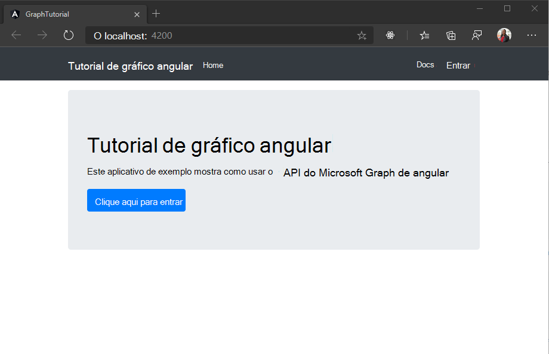

<!-- markdownlint-disable MD002 MD041 -->

<span data-ttu-id="7df02-101">Nesta seção, você criará um novo Angular projeto.</span><span class="sxs-lookup"><span data-stu-id="7df02-101">In this section, you'll create a new Angular project.</span></span>

1. <span data-ttu-id="7df02-102">Abra sua interface de linha de comando (CLI), navegue até um diretório no qual você tem direitos para criar arquivos e execute os seguintes comandos para instalar a ferramenta [Angular CLI](https://www.npmjs.com/package/@angular/cli) e criar um novo aplicativo Angular.</span><span class="sxs-lookup"><span data-stu-id="7df02-102">Open your command-line interface (CLI), navigate to a directory where you have rights to create files, and run the following commands to install the [Angular CLI](https://www.npmjs.com/package/@angular/cli) tool and create a new Angular app.</span></span>

    ```Shell
    npm install -g @angular/cli@11.2.9
    ng new graph-tutorial
    ```

1. <span data-ttu-id="7df02-103">A Angular CLI solicitará mais informações.</span><span class="sxs-lookup"><span data-stu-id="7df02-103">The Angular CLI will prompt for more information.</span></span> <span data-ttu-id="7df02-104">Responda aos prompts da seguinte forma.</span><span class="sxs-lookup"><span data-stu-id="7df02-104">Answer the prompts as follows.</span></span>

    ```Shell
    ? Do you want to enforce stricter type checking and stricter bundle budgets in the workspace? Yes
    ? Would you like to add Angular routing? Yes
    ? Which stylesheet format would you like to use? CSS
    ```

1. <span data-ttu-id="7df02-105">Depois que o comando terminar, altere para o diretório em sua CLI e execute `graph-tutorial` o seguinte comando para iniciar um servidor Web local.</span><span class="sxs-lookup"><span data-stu-id="7df02-105">Once the command finishes, change to the `graph-tutorial` directory in your CLI and run the following command to start a local web server.</span></span>

    ```Shell
    ng serve --open
    ```

1. <span data-ttu-id="7df02-106">Seu navegador padrão é aberto [https://localhost:4200/](https://localhost:4200) com uma página Angular padrão.</span><span class="sxs-lookup"><span data-stu-id="7df02-106">Your default browser opens to [https://localhost:4200/](https://localhost:4200) with a default Angular page.</span></span> <span data-ttu-id="7df02-107">Se o navegador não abrir, abra-o e navegue até verificar [https://localhost:4200/](https://localhost:4200) se o novo aplicativo funciona.</span><span class="sxs-lookup"><span data-stu-id="7df02-107">If your browser doesn't open, open it and browse to [https://localhost:4200/](https://localhost:4200) to verify that the new app works.</span></span>

## <a name="add-node-packages"></a><span data-ttu-id="7df02-108">Adicionar pacotes de nó</span><span class="sxs-lookup"><span data-stu-id="7df02-108">Add Node packages</span></span>

<span data-ttu-id="7df02-109">Antes de continuar, instale alguns pacotes adicionais que você usará posteriormente:</span><span class="sxs-lookup"><span data-stu-id="7df02-109">Before moving on, install some additional packages that you will use later:</span></span>

- <span data-ttu-id="7df02-110">[bootstrap](https://github.com/twbs/bootstrap) para estilo e componentes comuns.</span><span class="sxs-lookup"><span data-stu-id="7df02-110">[bootstrap](https://github.com/twbs/bootstrap) for styling and common components.</span></span>
- <span data-ttu-id="7df02-111">[ng-bootstrap para](https://github.com/ng-bootstrap/ng-bootstrap) usar componentes Bootstrap de Angular.</span><span class="sxs-lookup"><span data-stu-id="7df02-111">[ng-bootstrap](https://github.com/ng-bootstrap/ng-bootstrap) for using Bootstrap components from Angular.</span></span>
- <span data-ttu-id="7df02-112">[momento](https://github.com/moment/moment) para formatação de datas e horas.</span><span class="sxs-lookup"><span data-stu-id="7df02-112">[moment](https://github.com/moment/moment) for formatting dates and times.</span></span>
- [<span data-ttu-id="7df02-113">windows-iana</span><span class="sxs-lookup"><span data-stu-id="7df02-113">windows-iana</span></span>](https://github.com/rubenillodo/windows-iana)
- <span data-ttu-id="7df02-114">[msal-angular](https://github.com/AzureAD/microsoft-authentication-library-for-js/blob/dev/lib/msal-angular/README.md) para autenticação para Azure Active Directory e recuperação de tokens de acesso.</span><span class="sxs-lookup"><span data-stu-id="7df02-114">[msal-angular](https://github.com/AzureAD/microsoft-authentication-library-for-js/blob/dev/lib/msal-angular/README.md) for authenticating to Azure Active Directory and retrieving access tokens.</span></span>
- <span data-ttu-id="7df02-115">[microsoft-graph-client](https://github.com/microsoftgraph/msgraph-sdk-javascript) para fazer chamadas para o Microsoft Graph.</span><span class="sxs-lookup"><span data-stu-id="7df02-115">[microsoft-graph-client](https://github.com/microsoftgraph/msgraph-sdk-javascript) for making calls to Microsoft Graph.</span></span>

1. <span data-ttu-id="7df02-116">Execute os seguintes comandos em sua CLI.</span><span class="sxs-lookup"><span data-stu-id="7df02-116">Run the following commands in your CLI.</span></span>

    ```Shell
    npm install bootstrap@4.6.0 @ng-bootstrap/ng-bootstrap@9.1.0
    npm install @azure/msal-browser@2.14.0 @azure/msal-angular@2.0.0-beta.4
    npm install moment-timezone@0.5.33 windows-iana@5.0.2
    npm install @microsoft/microsoft-graph-client@2.2.1 @microsoft/microsoft-graph-types@1.35.0
    ```

1. <span data-ttu-id="7df02-117">Execute o seguinte comando em sua CLI para adicionar o pacote de Angular de localização (exigido pelo ng-bootstrap).</span><span class="sxs-lookup"><span data-stu-id="7df02-117">Run the following command in your CLI to add the Angular localization package (required by ng-bootstrap).</span></span>

    ```Shell
    ng add @angular/localize
    ```

## <a name="design-the-app"></a><span data-ttu-id="7df02-118">Design do aplicativo</span><span class="sxs-lookup"><span data-stu-id="7df02-118">Design the app</span></span>

<span data-ttu-id="7df02-119">Nesta seção, você criará a interface do usuário para o aplicativo.</span><span class="sxs-lookup"><span data-stu-id="7df02-119">In this section you'll create the user interface for the app.</span></span>

1. <span data-ttu-id="7df02-120">Abra **./src/styles.css** e adicione as seguintes linhas.</span><span class="sxs-lookup"><span data-stu-id="7df02-120">Open **./src/styles.css** and add the following lines.</span></span>

    :::code language="css" source="../demo/graph-tutorial/src/styles.css":::

1. <span data-ttu-id="7df02-121">Adicione o módulo Bootstrap ao aplicativo.</span><span class="sxs-lookup"><span data-stu-id="7df02-121">Add the Bootstrap module to the app.</span></span> <span data-ttu-id="7df02-122">Abra **./src/app/app.module.ts** e substitua seu conteúdo pelo seguinte.</span><span class="sxs-lookup"><span data-stu-id="7df02-122">Open **./src/app/app.module.ts** and replace its contents with the following.</span></span>

    ```typescript
    import { BrowserModule } from '@angular/platform-browser';
    import { FormsModule } from '@angular/forms';
    import { NgModule } from '@angular/core';
    import { NgbModule } from '@ng-bootstrap/ng-bootstrap';

    import { AppRoutingModule } from './app-routing.module';
    import { AppComponent } from './app.component';

    @NgModule({
      declarations: [
        AppComponent
      ],
      imports: [
        BrowserModule,
        FormsModule,
        AppRoutingModule,
        NgbModule
      ],
      providers: [],
      bootstrap: [AppComponent]
    })
    export class AppModule { }
    ```

1. <span data-ttu-id="7df02-123">Crie um novo arquivo na **pasta ./src/app** chamada **user.ts** e adicione o código a seguir.</span><span class="sxs-lookup"><span data-stu-id="7df02-123">Create a new file in the **./src/app** folder named **user.ts** and add the following code.</span></span>

    :::code language="typescript" source="../demo/graph-tutorial/src/app/user.ts" id="UserSnippet":::

1. <span data-ttu-id="7df02-124">Gere um Angular para a navegação superior na página.</span><span class="sxs-lookup"><span data-stu-id="7df02-124">Generate an Angular component for the top navigation on the page.</span></span> <span data-ttu-id="7df02-125">Em sua CLI, execute o seguinte comando.</span><span class="sxs-lookup"><span data-stu-id="7df02-125">In your CLI, run the following command.</span></span>

    ```Shell
    ng generate component nav-bar
    ```

1. <span data-ttu-id="7df02-126">Depois que o comando é concluído, abra **./src/app/nav-bar/nav-bar.component.ts** e substitua seu conteúdo pelo seguinte.</span><span class="sxs-lookup"><span data-stu-id="7df02-126">Once the command completes, open **./src/app/nav-bar/nav-bar.component.ts** and replace its contents with the following.</span></span>

    ```typescript
    import { Component, OnInit } from '@angular/core';

    import { User } from '../user';

    @Component({
      selector: 'app-nav-bar',
      templateUrl: './nav-bar.component.html',
      styleUrls: ['./nav-bar.component.css']
    })
    export class NavBarComponent implements OnInit {

      // Should the collapsed nav show?
      showNav: boolean = false;
      // Is a user logged in?
      authenticated: boolean = false;
      // The user
      user?: User = undefined;

      constructor() { }

      ngOnInit() { }

      // Used by the Bootstrap navbar-toggler button to hide/show
      // the nav in a collapsed state
      toggleNavBar(): void {
        this.showNav = !this.showNav;
      }

      signIn(): void {
        // Temporary
        this.authenticated = true;
        this.user = {
          displayName: 'Adele Vance',
          email: 'AdeleV@contoso.com',
          avatar: '',
          timeZone: ''
        };
      }

      signOut(): void {
        // Temporary
        this.authenticated = false;
        this.user = undefined;
      }
    }
    ```

1. <span data-ttu-id="7df02-127">Abra **./src/app/nav-bar/nav-bar.component.html** e substitua seu conteúdo pelo seguinte.</span><span class="sxs-lookup"><span data-stu-id="7df02-127">Open **./src/app/nav-bar/nav-bar.component.html** and replace its contents with the following.</span></span>

    :::code language="html" source="../demo/graph-tutorial/src/app/nav-bar/nav-bar.component.html" id="navHtml":::

1. <span data-ttu-id="7df02-128">Crie uma home page para o aplicativo.</span><span class="sxs-lookup"><span data-stu-id="7df02-128">Create a home page for the app.</span></span> <span data-ttu-id="7df02-129">Execute o seguinte comando em sua CLI.</span><span class="sxs-lookup"><span data-stu-id="7df02-129">Run the following command in your CLI.</span></span>

    ```Shell
    ng generate component home
    ```

1. <span data-ttu-id="7df02-130">Depois que o comando é concluído, abra **./src/app/home/home.component.ts** e substitua seu conteúdo pelo seguinte.</span><span class="sxs-lookup"><span data-stu-id="7df02-130">Once the command completes, open **./src/app/home/home.component.ts** and replace its contents with the following.</span></span>

    ```typescript
    import { Component, OnInit } from '@angular/core';

    import { User } from '../user';

    @Component({
      selector: 'app-home',
      templateUrl: './home.component.html',
      styleUrls: ['./home.component.css']
    })
    export class HomeComponent implements OnInit {

      // Is a user logged in?
      authenticated: boolean = false;
      // The user
      user?: User = undefined;

      constructor() { }

      ngOnInit() { }

      signIn(): void {
        // Temporary
        this.authenticated = true;
        this.user = {
          displayName: 'Adele Vance',
          email: 'AdeleV@contoso.com',
          avatar: '',
          timeZone: ''
        };
      }
    }
    ```

1. <span data-ttu-id="7df02-131">Abra **./src/app/home/home.component.html** e substitua seu conteúdo pelo seguinte.</span><span class="sxs-lookup"><span data-stu-id="7df02-131">Open **./src/app/home/home.component.html** and replace its contents with the following.</span></span>

    :::code language="html" source="../demo/graph-tutorial/src/app/home/home.component.html" id="homeHtml":::

1. <span data-ttu-id="7df02-132">Crie uma classe `Alert` simples.</span><span class="sxs-lookup"><span data-stu-id="7df02-132">Create a simple `Alert` class.</span></span> <span data-ttu-id="7df02-133">Crie um novo arquivo no **diretório ./src/app** chamado **alert.ts** e adicione o código a seguir.</span><span class="sxs-lookup"><span data-stu-id="7df02-133">Create a new file in the **./src/app** directory named **alert.ts** and add the following code.</span></span>

    :::code language="typescript" source="../demo/graph-tutorial/src/app/alert.ts" id="AlertSnippet":::

1. <span data-ttu-id="7df02-134">Crie um serviço de alerta que o aplicativo pode usar para exibir mensagens para o usuário.</span><span class="sxs-lookup"><span data-stu-id="7df02-134">Create an alert service that the app can use to display messages to the user.</span></span> <span data-ttu-id="7df02-135">Em sua CLI, execute o seguinte comando.</span><span class="sxs-lookup"><span data-stu-id="7df02-135">In your CLI, run the following command.</span></span>

    ```Shell
    ng generate service alerts
    ```

1. <span data-ttu-id="7df02-136">Abra **./src/app/alerts.service.ts** e substitua seu conteúdo pelo seguinte.</span><span class="sxs-lookup"><span data-stu-id="7df02-136">Open **./src/app/alerts.service.ts** and replace its contents with the following.</span></span>

    :::code language="typescript" source="../demo/graph-tutorial/src/app/alerts.service.ts" id="alertsService":::

1. <span data-ttu-id="7df02-137">Gere um componente de alertas para exibir alertas.</span><span class="sxs-lookup"><span data-stu-id="7df02-137">Generate an alerts component to display alerts.</span></span> <span data-ttu-id="7df02-138">Em sua CLI, execute o seguinte comando.</span><span class="sxs-lookup"><span data-stu-id="7df02-138">In your CLI, run the following command.</span></span>

    ```Shell
    ng generate component alerts
    ```

1. <span data-ttu-id="7df02-139">Depois que o comando é concluído, abra **./src/app/alerts/alerts.component.ts** e substitua seu conteúdo pelo seguinte.</span><span class="sxs-lookup"><span data-stu-id="7df02-139">Once the command completes, open **./src/app/alerts/alerts.component.ts** and replace its contents with the following.</span></span>

    :::code language="typescript" source="../demo/graph-tutorial/src/app/alerts/alerts.component.ts" id="AlertsComponentSnippet":::

1. <span data-ttu-id="7df02-140">Abra **./src/app/alerts/alerts.component.html** e substitua seu conteúdo pelo seguinte.</span><span class="sxs-lookup"><span data-stu-id="7df02-140">Open **./src/app/alerts/alerts.component.html** and replace its contents with the following.</span></span>

    :::code language="html" source="../demo/graph-tutorial/src/app/alerts/alerts.component.html" id="AlertHtml":::

1. <span data-ttu-id="7df02-141">Abra **./src/app/app-routing.module.ts** e substitua a `const routes: Routes = [];` linha pelo código a seguir.</span><span class="sxs-lookup"><span data-stu-id="7df02-141">Open **./src/app/app-routing.module.ts** and replace the `const routes: Routes = [];` line with the following code.</span></span>

    ```typescript
    import { HomeComponent } from './home/home.component';

    const routes: Routes = [
      { path: '', component: HomeComponent },
    ];
    ```

1. <span data-ttu-id="7df02-142">Abra **./src/app/app.component.html** e substitua todo o conteúdo pelo seguinte.</span><span class="sxs-lookup"><span data-stu-id="7df02-142">Open **./src/app/app.component.html** and replace its entire contents with the following.</span></span>

    :::code language="html" source="../demo/graph-tutorial/src/app/app.component.html" id="AppHtml":::

1. <span data-ttu-id="7df02-143">Adicione um arquivo de imagem de sua escolha **no-profile-photo.png** no **diretório ./src/assets.**</span><span class="sxs-lookup"><span data-stu-id="7df02-143">Add an image file of your choosing named **no-profile-photo.png** in the **./src/assets** directory.</span></span> <span data-ttu-id="7df02-144">Essa imagem será usada como a foto do usuário quando o usuário não tiver nenhuma foto no Microsoft Graph.</span><span class="sxs-lookup"><span data-stu-id="7df02-144">This image will be used as the user's photo when the user has no photo in Microsoft Graph.</span></span>

<span data-ttu-id="7df02-145">Salve todas as alterações e atualize a página.</span><span class="sxs-lookup"><span data-stu-id="7df02-145">Save all of your changes and refresh the page.</span></span> <span data-ttu-id="7df02-146">Agora, o aplicativo deve ter uma aparência muito diferente.</span><span class="sxs-lookup"><span data-stu-id="7df02-146">Now, the app should look very different.</span></span>


