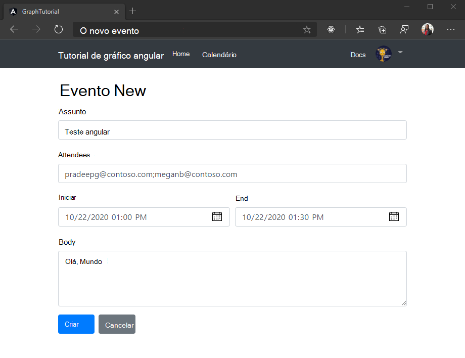

<!-- markdownlint-disable MD002 MD041 -->

<span data-ttu-id="02ab8-101">Nesta seção, você adicionará a capacidade de criar eventos no calendário do usuário.</span><span class="sxs-lookup"><span data-stu-id="02ab8-101">In this section you will add the ability to create events on the user's calendar.</span></span>

1. <span data-ttu-id="02ab8-102">Abra **./src/app/Graph.Service.TS** e adicione a função a seguir à `GraphService` classe.</span><span class="sxs-lookup"><span data-stu-id="02ab8-102">Open **./src/app/graph.service.ts** and add the following function to the `GraphService` class.</span></span>

    :::code language="typescript" source="../demo/graph-tutorial/src/app/graph.service.ts" id="AddEventSnippet":::

## <a name="create-a-new-event-form"></a><span data-ttu-id="02ab8-103">Criar um novo formulário de eventos</span><span class="sxs-lookup"><span data-stu-id="02ab8-103">Create a new event form</span></span>

1. <span data-ttu-id="02ab8-104">Criar um componente angular para exibir um formulário e chamar essa nova função.</span><span class="sxs-lookup"><span data-stu-id="02ab8-104">Create an Angular component to display a form and call this new function.</span></span> <span data-ttu-id="02ab8-105">Execute o seguinte comando em sua CLI.</span><span class="sxs-lookup"><span data-stu-id="02ab8-105">Run the following command in your CLI.</span></span>

    ```Shell
    ng generate component new-event
    ```

1. <span data-ttu-id="02ab8-106">Depois que o comando for concluído, adicione o componente à `routes` matriz em **./src/app/app-Routing.Module.TS**.</span><span class="sxs-lookup"><span data-stu-id="02ab8-106">Once the command completes, add the component to the `routes` array in **./src/app/app-routing.module.ts**.</span></span>

    ```typescript
    import { NewEventComponent } from './new-event/new-event.component';

    const routes: Routes = [
      { path: '', component: HomeComponent },
      { path: 'calendar', component: CalendarComponent },
      { path: 'newevent', component: NewEventComponent },
    ];
    ```

1. <span data-ttu-id="02ab8-107">Crie um novo arquivo no diretório **./src/App/New-Event** chamado **New-Event. TS** e adicione o código a seguir.</span><span class="sxs-lookup"><span data-stu-id="02ab8-107">Create a new file in the **./src/app/new-event** directory named **new-event.ts** and add the following code.</span></span>

    :::code language="typescript" source="../demo/graph-tutorial/src/app/new-event/new-event.ts" id="NewEventSnippet":::

    <span data-ttu-id="02ab8-108">Essa classe servirá como o modelo para o novo formulário de eventos.</span><span class="sxs-lookup"><span data-stu-id="02ab8-108">This class will serve as the model for the new event form.</span></span>

1. <span data-ttu-id="02ab8-109">Abra **./src/App/New-Event/New-Event.Component.TS** e substitua seu conteúdo pelo código a seguir.</span><span class="sxs-lookup"><span data-stu-id="02ab8-109">Open **./src/app/new-event/new-event.component.ts** and replace its contents with the following code.</span></span>

    :::code language="typescript" source="../demo/graph-tutorial/src/app/new-event/new-event.component.ts" id="NewEventComponentSnippet":::

1. <span data-ttu-id="02ab8-110">Abra **./src/app/new-event/new-event.component.html** e substitua seu conteúdo pelo código a seguir.</span><span class="sxs-lookup"><span data-stu-id="02ab8-110">Open **./src/app/new-event/new-event.component.html** and replace its contents with the following code.</span></span>

    :::code language="html" source="../demo/graph-tutorial/src/app/new-event/new-event.component.html" id="NewEventFormSnippet":::

1. <span data-ttu-id="02ab8-111">Salve as alterações e atualize o aplicativo.</span><span class="sxs-lookup"><span data-stu-id="02ab8-111">Save the changes and refresh the app.</span></span> <span data-ttu-id="02ab8-112">Selecione o botão **novo evento** na página calendário e, em seguida, use o formulário para criar um evento no calendário do usuário.</span><span class="sxs-lookup"><span data-stu-id="02ab8-112">Select the **New event** button on the calendar page, then use the form to create an event on the user's calendar.</span></span>

    
