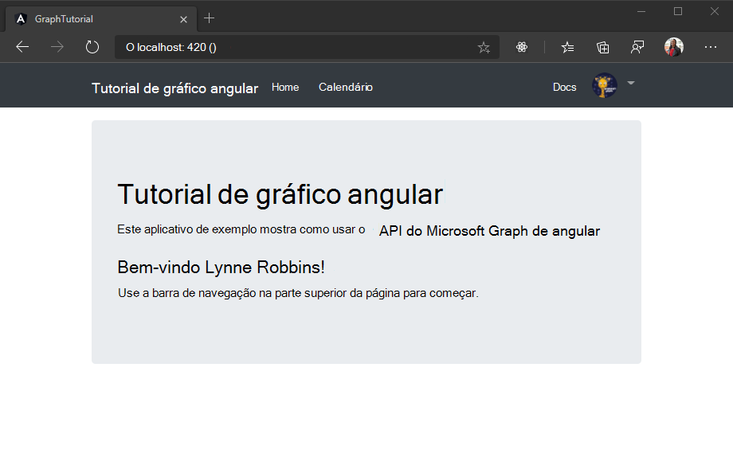
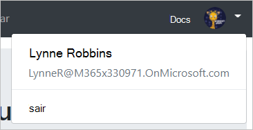

<!-- markdownlint-disable MD002 MD041 -->

Neste exercício, você estenderá o aplicativo do exercício anterior para oferecer suporte à autenticação com o Azure AD. Isso é necessário para obter o token de acesso OAuth necessário para chamar o Microsoft Graph. Nesta etapa, você integrará a [biblioteca de autenticação da Microsoft para o angular](https://github.com/AzureAD/microsoft-authentication-library-for-js/blob/dev/lib/msal-angular/README.md) no aplicativo.

Crie um novo arquivo no `./src` diretório chamado `oauth.ts` e adicione o código a seguir.

```TypeScript
export const OAuthSettings = {
  appId: 'YOUR_APP_ID_HERE',
  scopes: [
    "user.read",
    "calendars.read"
  ]
};
```

Substitua `YOUR_APP_ID_HERE` pela ID do aplicativo do portal de registro do aplicativo.

> [!IMPORTANT]
> Se você estiver usando o controle de origem como o Git, agora seria uma boa hora para excluir `oauth.ts` o arquivo do controle de origem para evitar vazar inadvertidamente sua ID de aplicativo.

Abra `./src/app/app.module.ts` e adicione as seguintes `import` instruções à parte superior do arquivo.

```TypeScript
import { MsalModule } from '@azure/msal-angular';
import { OAuthSettings } from '../oauth';
```

Em seguida, `MsalModule` adicione o `imports` à matriz dentro `@NgModule` da declaração e inicialize-o com a ID do aplicativo.

```TypeScript
imports: [
  BrowserModule,
  AppRoutingModule,
  NgbModule,
  FontAwesomeModule,
  MsalModule.forRoot({
    clientID: OAuthSettings.appId
  })
],
```

## <a name="implement-sign-in"></a>Implementar logon

Comece definindo uma classe simples `User` para armazenar as informações sobre o usuário que o aplicativo exibe. Crie um novo arquivo na `./src/app` pasta chamada `user.ts` e adicione o código a seguir.

```TypeScript
export class User {
  displayName: string;
  email: string;
  avatar: string;
}
```

Agora, crie um serviço de autenticação. Ao criar um serviço para isso, você pode injetar-o facilmente em qualquer componente que precise acessar os métodos de autenticação. Execute o seguinte comando em sua CLI.

```Shell
ng generate service auth
```

Quando o comando terminar, abra o `./src/app/auth.service.ts` arquivo e substitua seu conteúdo pelo código a seguir.

```TypeScript
import { Injectable } from '@angular/core';
import { MsalService } from '@azure/msal-angular';

import { AlertsService } from './alerts.service';
import { OAuthSettings } from '../oauth';
import { User } from './user';

@Injectable({
  providedIn: 'root'
})
export class AuthService {
  public authenticated: boolean;
  public user: User;

  constructor(
    private msalService: MsalService,
    private alertsService: AlertsService) {

    this.authenticated = false;
    this.user = null;
  }

  // Prompt the user to sign in and
  // grant consent to the requested permission scopes
  async signIn(): Promise<void> {
    let result = await this.msalService.loginPopup(OAuthSettings.scopes)
      .catch((reason) => {
        this.alertsService.add('Login failed', JSON.stringify(reason, null, 2));
      });

    if (result) {
      this.authenticated = true;
      // Temporary placeholder
      this.user = new User();
      this.user.displayName = "Adele Vance";
      this.user.email = "AdeleV@contoso.com";
    }
  }

  // Sign out
  signOut(): void {
    this.msalService.logout();
    this.user = null;
    this.authenticated = false;
  }

  // Silently request an access token
  async getAccessToken(): Promise<string> {
    let result = await this.msalService.acquireTokenSilent(OAuthSettings.scopes)
      .catch((reason) => {
        this.alertsService.add('Get token failed', JSON.stringify(reason, null, 2));
      });

    // Temporary to display token in an error box
    if (result) this.alertsService.add('Token acquired', result);
    return result;
  }
}
```

Agora que você tem o serviço de autenticação, ele pode ser injetado nos componentes que fazem logon. Comece com o `NavBarComponent`. Abra o `./src/app/nav-bar/nav-bar.component.ts` arquivo e faça as seguintes alterações.

- Adicionar `import { AuthService } from '../auth.service';` à parte superior do arquivo.
- Remova as `authenticated` propriedades `user` e da classe e remova o código que as define `ngOnInit`.
- Injetar `AuthService` o adicionando o seguinte parâmetro ao `constructor`:. `private authService: AuthService`
- Substitua o método `signIn` existente pelo seguinte:

    ```TypeScript
    async signIn(): Promise<void> {
      await this.authService.signIn();
    }
    ```

- Substitua o método `signOut` existente pelo seguinte:

    ```TypeScript
    signOut(): void {
      this.authService.signOut();
    }
    ```

Quando você terminar, o código deverá ser semelhante ao seguinte.

```TypeScript
import { Component, OnInit } from '@angular/core';

import { AuthService } from '../auth.service';

@Component({
  selector: 'app-nav-bar',
  templateUrl: './nav-bar.component.html',
  styleUrls: ['./nav-bar.component.css']
})
export class NavBarComponent implements OnInit {

  // Should the collapsed nav show?
  showNav: boolean;

  constructor(private authService: AuthService) { }

  ngOnInit() {
    this.showNav = false;
  }

  // Used by the Bootstrap navbar-toggler button to hide/show
  // the nav in a collapsed state
  toggleNavBar(): void {
    this.showNav = !this.showNav;
  }

  async signIn(): Promise<void> {
    await this.authService.signIn();
  }

  signOut(): void {
    this.authService.signOut();
  }
}
```

Desde que você `authenticated` removeu `user` as propriedades e na classe, você também precisa atualizar o `./src/app/nav-bar/nav-bar.component.html` arquivo. Abra esse arquivo e faça as seguintes alterações.

- Substitua todas as instâncias do `authenticated` por `authService.authenticated`.
- Substitua todas as instâncias `user` de `authService.user`por.

Em seguida, `HomeComponent` atualize a classe. Faça todas as alterações que você fez `./src/app/home/home.component.ts` na `NavBarComponent` classe com as seguintes exceções.

- Não há nenhum `signOut` método na `HomeComponent` classe.
- Substitua o `signIn` método por uma versão um pouco diferente. Este código chama `getAccessToken` para obter um token de acesso, que, por sua vez, irá gerar o token como um erro.

    ```TypeScript
    async signIn(): Promise<void> {
      await this.authService.signIn();

      // Temporary to display the token
      if (this.authService.authenticated) {
        let token = await this.authService.getAccessToken();
      }
    }
    ```

Quando terminar, o arquivo deverá ter a seguinte aparência.

```TypeScript
import { Component, OnInit } from '@angular/core';
import { AuthService } from '../auth.service';

@Component({
  selector: 'app-home',
  templateUrl: './home.component.html',
  styleUrls: ['./home.component.css']
})
export class HomeComponent implements OnInit {

  constructor(private authService: AuthService) { }

  ngOnInit() {
  }

  async signIn(): Promise<void> {
    await this.authService.signIn();

    // Temporary to display the token
    if (this.authService.authenticated) {
      let token = await this.authService.getAccessToken();
    }
  }
}
```

Por fim, faça as mesmas substituições `./src/app/home/home.component.html` que você fez para a barra de navegação.

Salve suas alterações e atualize o navegador. Clique no botão **clique aqui para entrar** e você deve ser redirecionado para `https://login.microsoftonline.com`o. Faça logon com sua conta da Microsoft e concorde com as permissões solicitadas. A página do aplicativo deve ser atualizada, mostrando o token.

### <a name="get-user-details"></a>Obter detalhes do usuário

No momento, o serviço de autenticação define valores constantes para o nome de exibição e endereço de email do usuário. Agora que você tem um token de acesso, você pode obter detalhes do usuário do Microsoft Graph para que esses valores correspondam ao usuário atual. Abra `./src/app/auth.service.ts` e adicione a seguinte `import` instrução à parte superior do arquivo.

```TypeScript
import { Client } from '@microsoft/microsoft-graph-client';
```

Adicione uma nova função à classe `AuthService` chamada `getUser`.

```TypeScript
private async getUser(): Promise<User> {
  if (!this.authenticated) return null;

  let graphClient = Client.init({
    // Initialize the Graph client with an auth
    // provider that requests the token from the
    // auth service
    authProvider: async(done) => {
      let token = await this.getAccessToken()
        .catch((reason) => {
          done(reason, null);
        });

      if (token)
      {
        done(null, token);
      } else {
        done("Could not get an access token", null);
      }
    }
  });

  // Get the user from Graph (GET /me)
  let graphUser = await graphClient.api('/me').get();

  let user = new User();
  user.displayName = graphUser.displayName;
  // Prefer the mail property, but fall back to userPrincipalName
  user.email = graphUser.mail || graphUser.userPrincipalName;

  return user;
}
```

Localize e remova o código a seguir do `signIn` método.

```TypeScript
// Temporary placeholder
this.user = new User();
this.user.displayName = "Adele Vance";
this.user.email = "AdeleV@contoso.com";
```

Em seu lugar, adicione o código a seguir.

```TypeScript
this.user = await this.getUser();
```

Este novo código usa o SDK do Microsoft Graph para obter os detalhes do usuário e, em `User` seguida, cria um objeto usando valores retornados pela chamada à API.

Agora altere o `constructor` para a `AuthService` classe para verificar se o usuário já está conectado e carregar seus detalhes, se for o caso. Substitua o existente `constructor` pelo seguinte.

```TypeScript
constructor(
  private msalService: MsalService,
  private alertsService: AlertsService) {

  this.authenticated = this.msalService.getUser() != null;
  this.getUser().then((user) => {this.user = user});
}
```

Por fim, remova o código temporário da `HomeComponent` classe. Abra o `./src/app/home/home.component.ts` arquivo e substitua a função `signIn` existente pelo seguinte.

```TypeScript
async signIn(): Promise<void> {
  await this.authService.signIn();
}
```

Agora, se você salvar as alterações e iniciar o aplicativo, depois de entrar, você deverá terminar de volta na Home Page, mas a interface do usuário deverá mudar para indicar que você está conectado.



Clique no avatar do usuário no canto superior direito para acessar o **** link sair. Clicar **** em sair redefine a sessão e retorna à Home Page.



## <a name="storing-and-refreshing-tokens"></a>Armazenar e atualizar tokens

Nesse ponto, seu aplicativo tem um token de acesso, que é enviado no `Authorization` cabeçalho das chamadas de API. Este é o token que permite que o aplicativo acesse o Microsoft Graph em nome do usuário.

No enTanto, esse token é de vida curta. O token expira uma hora após sua emissão. Como o aplicativo está usando a biblioteca MSAL, você não precisa implementar qualquer lógica de armazenamento ou de atualização. O `MsalService` armazena em cache o token no armazenamento do navegador. O `acquireTokenSilent` método primeiro verifica o token em cache e, se ele não tiver expirado, ele o retornará. Se ele tiver expirado, ele fará uma solicitação silenciosa para obter um novo.