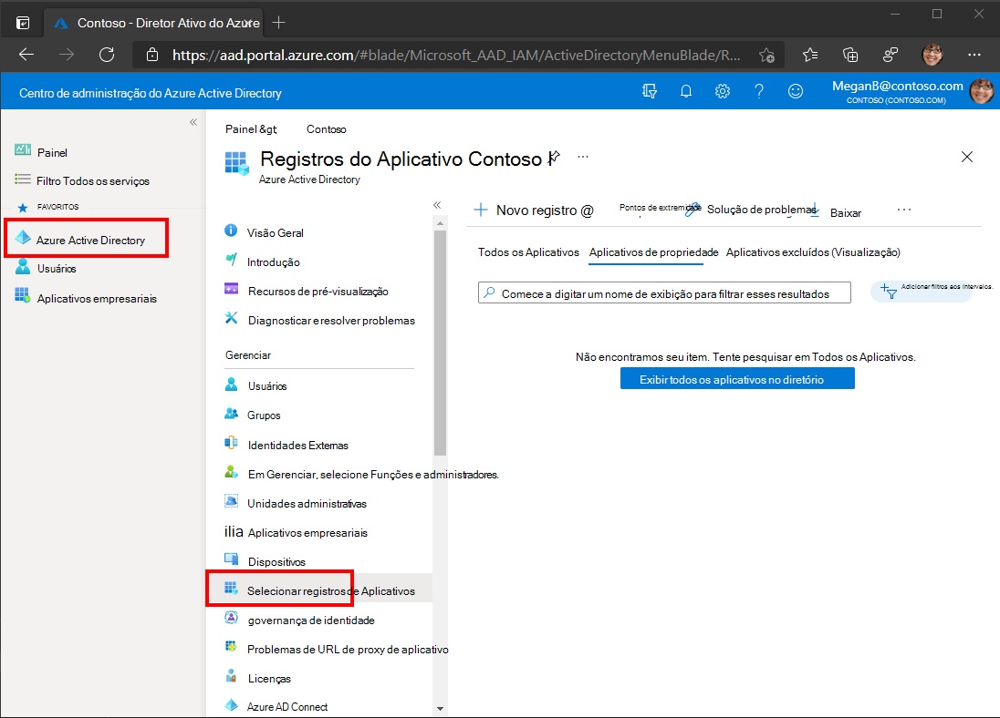
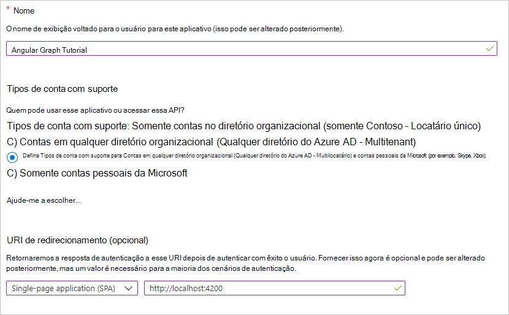

<!-- markdownlint-disable MD002 MD041 -->

Neste exercício, você criará um novo registro de aplicativo Web do Azure AD usando o centro de administração do Azure Active Directory.In this exercise, you will create a new Azure AD web application registration using the Azure Active Directory admin center.

1. Abra um navegador e navegue até o [centro de administração do Azure Active Directory](https://aad.portal.azure.com).Open a browser and navigate to the [Azure Active Directory admin center](https://aad.portal.azure.com). Faça logon usando uma **conta pessoal** (aka: conta da Microsoft) ou **conta corporativa ou de estudante**.Login using a **personal account** (aka: Microsoft Account) or **Work or School Account**.

1. Selecione **Azure Active Directory** na navegação à esquerda e, em seguida, selecione **registros de aplicativo (visualização)** em **gerenciar**.Select **Azure Active Directory** in the left-hand navigation, then select **App registrations (Preview)** under **Manage**.

    

1. Selecione **novo registro**.Select **New registration**. Na página **registrar um aplicativo** , defina os valores da seguinte maneira.On the **Register an application** page, set the values as follows.

    - Defina \*\*\*\* o nome `Angular Graph Tutorial`como.Set **Name** to `Angular Graph Tutorial`.
    - Defina os **tipos de conta com suporte** para **contas em qualquer diretório organizacional e contas pessoais da Microsoft**.Set **Supported account types** to **Accounts in any organizational directory and personal Microsoft accounts**.
    - Em **URI**de redirecionamento, defina o primeiro menu `Web` suspenso como e defina o `http://localhost:4200`valor como.Under **Redirect URI**, set the first drop-down to `Web` and set the value to `http://localhost:4200`.

    

1. Escolha **registrar**.Choose **Register**. Na página **tutorial do gráfico angular** , copie o valor da **ID do aplicativo (cliente)** e salve-o, você precisará dele na próxima etapa.On the **Angular Graph Tutorial** page, copy the value of the **Application (client) ID** and save it, you will need it in the next step.

    

1. Selecione **autenticação** em **gerenciar**.Select **Authentication** under **Manage**. Localize a seção **Grant implícita** e habilite tokens de **acesso** e tokens de **ID**.Locate the **Implicit grant** section and enable **Access tokens** and **ID tokens**. Selecione **Salvar**.Choose **Save**.

    
